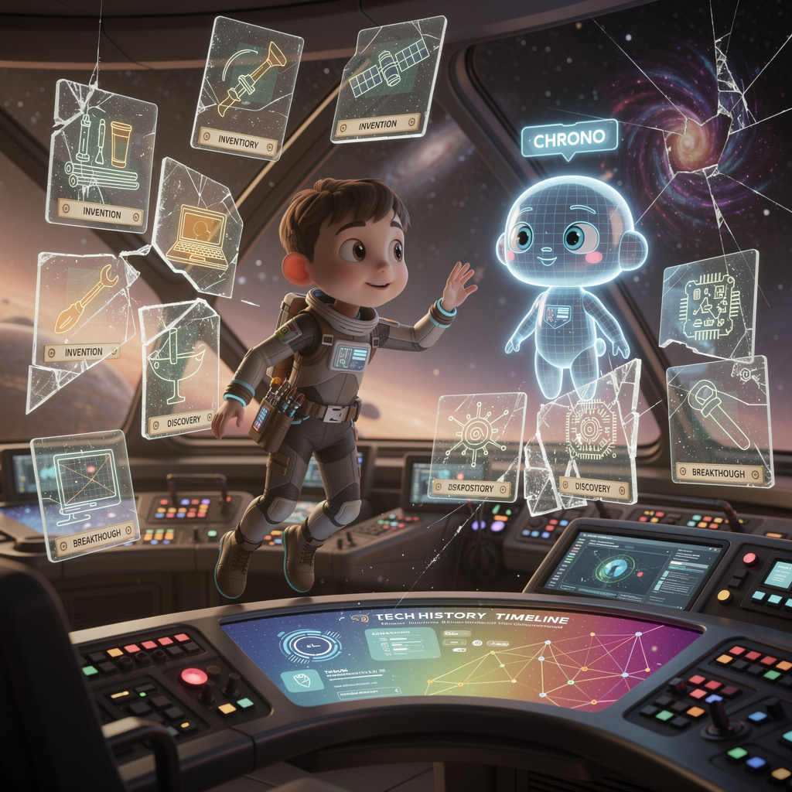

# AI-made javascript course

A javascript course made by AI. This course teaches you to write websites in JavaScript through an immersive sci-fi narrative where you play the role of a Time Archaeologist aboard the Chrono-Vault.

---

## The Story

The student is a Time Archaeologist aboard the Chrono-Vault, a starship that preserves humanity's technological heritage. A quantum anomaly has shattered the Tech History Timeline—a living database of inventions, discoveries, and breakthroughs. The AI guide, **"Chrono"**, enlists the student to rebuild the timeline using web technologies before history itself unravels. Each chapter is a step in the repair protocol, with exercises framed as missions to restore fragments of the past.

## Chapters

1. **How Websites Work**: Calibrating the temporal scanners to understand web communication.
2. **HTML Refresher**: Reconstructing the Chrono-Vault interface.
3. **CSS**: Restoring the visual aesthetic of the Tech History Timeline.
4. **JavaScript Fundamentals**: Programming the temporal logic and data structures.
5. **Working with the DOM**: Establishing a neural link with the interface.
6. **Asynchronous JavaScript**: Dealing with temporal delays and data fetching.
7. **Working with APIs**: Recovering lost data from the Wikipedia archives.
8. **Data Visualization**: Activating the holographic timeline display.
9. **Modern JS Development**: Optimizing the repair protocol with modules and tools.
10. **Testing**: Verifying the temporal stability of our repairs with Vitest.
11. **Frontend Frameworks & TypeScript**: Building advanced typed components with Svelte for the Chrono-Vault.
12. **Backend with Node.js**: Creating a central hub for history data.
13. **Full-Stack Application**: Integrating the entire system for a permanent fix.
14. **Deployment**: Uploading the restored timeline to the global network.
